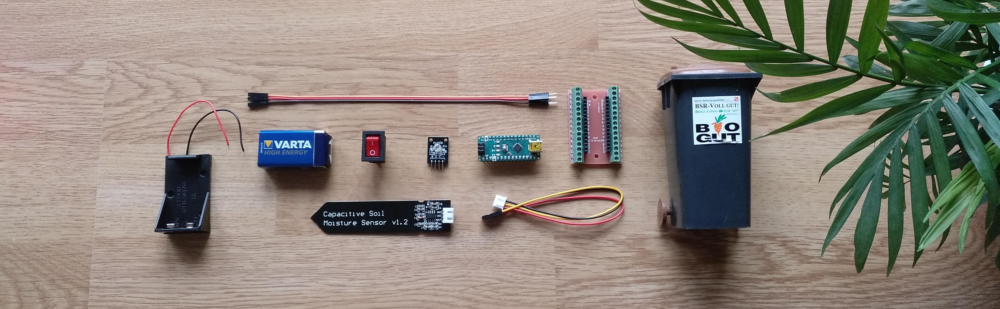

# Biotonne

Check the moisture of a plant using a tiny organic waste container.

## Parts

* small Biogut container
* Arduino Nano Every
* soil moisture sensor
* KY-016 RGB LED modul
* switch
* wires
* 9V battery clip
* 9V battery

## Build

We use [`arduino-cli`](https://github.com/arduino/arduino-cli) and [`arduino.sh`](https://github.com/x70b1/arduino.sh) to build our sketch.

Just run `build.sh`.

## Usage

The LED shows different colors.

* green: optimal moisture
* red (flashing): add more water
